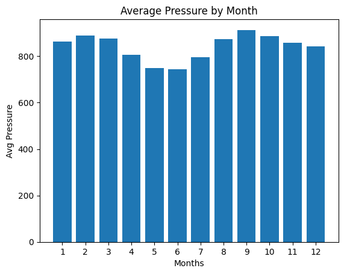
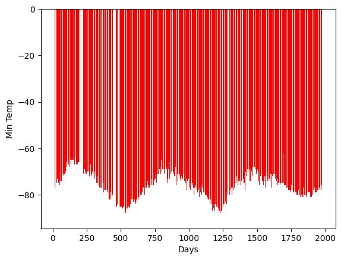

# Mission_to_mars

## Overview

This project focuses on scraping data from a NASA website to inform SpaceForward, a fictional aerospace company, about Mars' climate.

### Goals

1. Apply web scraping tools such as Splinter and Beautiful Soup
2. Organize collected data 
3. Create visuals that show insights

## Resources

- Data Source: https://redplanetscience.com, https://data-class-mars-challenge.s3.amazonaws.com/Mars/index.html
- Software: Python, Jupyter Notebook

## Analysis

1. Scrape News Titles and Summaries 

First, we automated the browsing using Splinter to visit the Mars news website; then, we used Beautiful Soup to extract the html code. 
We then sorted through the html code to pull the news titles and summaries, which we then placed into a list of dictionaries.

This is the exported JSON file, [Mars_news](Mission_to_Mars_Challenge/analysis/Mars_news.csv)

2. Scrape Mars Weather Data

We used Splinter to automate visiting the Mars weather site and Beautiful Soup to extract the html code.
From the html, we pulled the data from the table and placed it into a Pandas data frame.

From the 1867 martian days of data, we concluded that there are 12 months on Mars ; however, after researching further, we found that there are 24 months on Mars. We were confused that the data given to us from the Curiosity rover was broken down into 12 months instead of 24, but we still based the rest of the project on the fact that there are only 12 months on mars.

The coldest months observed on Mars were months 3 and 4; whereas the warmest months on average were 8 and 9. (Seen below)

The month with the highest atmospheric pressure is month 9, and the month with the lowest is 6. (Seen below)

Looking at the chart below, we can discern that a Martian year has almost double the number of days of an Earth year. After a quick google search, we found that a Martian year has 687 days. (Seen below)

